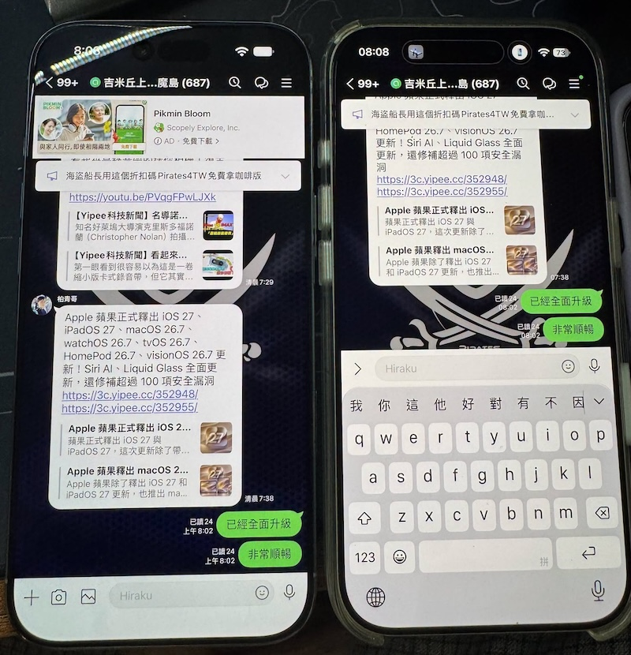

# LINE Cheater - Multidevice

此工具將第二隻 iPhone 偽裝為 iPad 副裝置，以完成同一個 LINE 帳號的副裝置登入認證。

## 支援版本 📦

| LINE 版本 | 需要越獄 | 安裝方式 | 優點 | 缺點 |
|---|---|---|---|---|
| 15.7.2 | 是 | Dopamine + AppSync | 支援 iOS 16.7.16，有推播通知 | 需要越獄，版本較舊 |
| 26.14.0 | 否 | 自己簽署 | 不需要越獄，版本較新 | 需要 iOS 18 以上，沒有推播通知 |

推薦使用 iPhone 8 或 iPhone X。這些機型可在最新的 iOS 16.7.16 使用 Dopamine 越獄，再搭配 AppSync 安裝 15.7.2，不需要另外尋找特定版本的機器，並可保留通知功能。

### LINE 15.7.2

使用 decrypt 過的 dump IPA 建置。若同版本 dump 的 executable SHA-256 不同，可加上 `--allow-unverified`；工具仍會檢查 bundle ID、版本、build 和原始指令：

```sh
python3 tools/main.py --legacy-keychain-compat --require-push --allow-unverified \
  LINE-decrypted.ipa output/LINE-15.7.2.ipa
```
若在越獄裝置上操作，可以使用 [ipa-dumper](https://github.com/hirakujira/ipa-dumper) 取得 decrypted IPA。
此版本已測試可使用副裝置登入、收發訊息和接收通知。

### LINE 26.14.0

```sh
python3 tools/main.py --keychain-compat \
  jp.naver.line_26.14.0_und3fined.ipa \
  output/LINE-26.14.0.ipa
```

同樣需要 decrypted 過的 IPA，如果沒有越獄裝置可以進行 dump，請自行在網路上搜尋現成的 IPA。
此版本使用自己的憑證和 provisioning profile 完整重簽，可收發訊息，但是沒有推播通知。
重簽可以使用 [AltStore](https://altstore.io/) 或 [Sideloadly](https://sideloadly.io/)。

## 實際效果 📱



## 原理 ⚙️

- LINE 會檢查裝置是否為 iPad，工具只修改副裝置登入入口的條件跳轉，不會全域偽裝裝置。
- 注入相容層，在 App Group 無法使用時改用 App 私有目錄，並處理部分 Keychain 不相容問題。
- 修改後由 `ldid` 重新簽署，AppSync 讓越獄裝置可以安裝。
- 15.7.2 會保留 dump IPA 的 bundle ID、APNs 與 Keychain entitlement，因此目前可實測收到通知。
- 工具會核對版本、build 和執行檔 SHA-256，只對已分析的版本套用修補。

## 注意 ⚠️

- 只支援已核對的版本和 IPA，其他版本會拒絕處理。
- 請先備份 LINE 資料，再於測試裝置安裝。

## 免責聲明 📄

本專案僅供學術研究、相容性測試與教育用途，為非官方研究與修改工具，與 LINE、NAVER 或 Apple 無關。使用修改後的 IPA 可能造成帳號、聊天資料或通知功能異常，也可能違反相關服務條款。請先備份資料，並確認使用方式符合適用法令及相關服務條款；使用者須自行承擔所有風險與責任。
